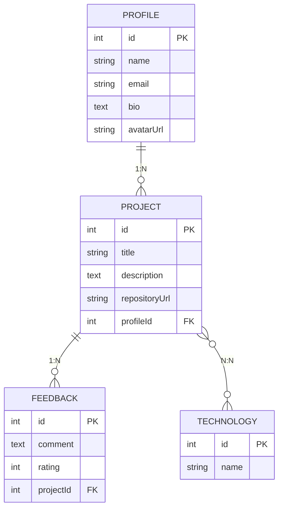
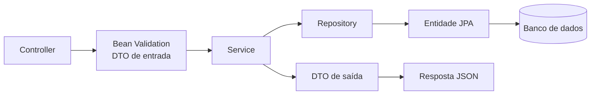

# DevShowcase API

Backend da plataforma **DevShowcase**.

> **Etapa 1 do projeto prático:** modelagem de domínio, persistência relacional e endpoints básicos.

## Contexto acadêmico

| Item | Detalhe |
|---|---|
| Instituição | Universidade Aberta do Brasil (UAB) / UESPI |
| Curso | Tecnologia em Sistemas para Internet |
| Disciplina | Backend |
| Atividade | Modelagem de domínio, persistência e endpoints básicos |
| Prazo | 05/09/2026 às 18h00 até 25/09/2026 às 23h59 |

**Objetivo da atividade:** nesta primeira etapa do projeto prático, dar início ao desenvolvimento do backend da plataforma DevShowcase API, implementando a fundação arquitetural da aplicação com suporte a persistência de dados relacional.

**Requisitos técnicos entregues:**
1. Projeto Java/Spring Boot estruturado, com repositório git público e `.gitignore` adequado.
2. Modelagem das entidades `Profile`, `Project`, `Technology` e `Feedback`, com os relacionamentos `Profile 1:N Project`, `Project N:N Technology` e `Project 1:N Feedback`.
3. Repositórios de persistência (Spring Data JPA) e DTOs de entrada (com validação Bean Validation de campos obrigatórios e URLs) e de saída.
4. Endpoints REST implementados e testados: `POST/GET /api/profiles`, `POST/GET /api/technologies` e `POST/GET /api/projects`.

## Sumário

- [Contexto acadêmico](#contexto-acadêmico)
- [Stack tecnológica](#stack-tecnológica)
- [Modelagem de domínio](#modelagem-de-domínio)
- [Arquitetura do projeto](#arquitetura-do-projeto)
- [Pré-requisitos](#pré-requisitos)
- [Como rodar localmente](#como-rodar-localmente)
- [Roteiro de apresentação (demo ao vivo)](#roteiro-de-apresentação-demo-ao-vivo)
- [Endpoints da API](#endpoints-da-api)
- [Testes automatizados](#testes-automatizados)
- [Solução de problemas](#solução-de-problemas)
- [Próximas etapas](#próximas-etapas)

## Stack tecnológica

| Camada          | Tecnologia                                    |
|-----------------|------------------------------------------------|
| Runtime         | Java (≥ 21)                                    |
| Framework HTTP  | Spring Boot (Spring MVC)                       |
| ORM             | Spring Data JPA / Hibernate — PostgreSQL       |
| Banco de dados  | PostgreSQL (driver `org.postgresql`)           |
| Containers      | Docker + Docker Compose                        |
| Validação       | Bean Validation / Hibernate Validator (DTOs)   |
| Testes          | JUnit 5 + MockMvc (H2 em memória)              |

## Modelagem de domínio

4 entidades e 3 relacionamentos, conforme exigido na especificação:



- **Profile 1:N Project** — um perfil possui vários projetos.
- **Project N:N Technology** — um projeto usa várias tecnologias, e uma tecnologia aparece em vários projetos (tabela de junção `project_technologies`).
- **Project 1:N Feedback** — um projeto recebe vários feedbacks.

## Arquitetura do projeto

Fluxo de uma requisição, camada por camada:



```
src/main/java/br/uab/uespi/devshowcase/api/
  entity/               # Entidades JPA e associações (Profile, Project, Technology, Feedback)
  dto/request/          # DTOs de entrada com Bean Validation
  dto/response/         # DTOs de saída (formatação da resposta)
  repository/           # Spring Data JPA (queries)
  service/               # Regras de negócio de cada endpoint
  controller/            # Definição das rotas REST
  exception/             # Exceções customizadas e tratamento global de erros
  config/                # Configuração de CORS
  DevshowcaseApiApplication.java  # Ponto de entrada Spring Boot
src/main/resources/application.yml  # Configuração do datasource PostgreSQL
src/test/java/...       # Testes de integração (JUnit 5 + MockMvc)
scripts/
  init-multiple-databases.sh  # Cria os bancos dev/test no container do PostgreSQL
pom.xml                  # Dependências e build Maven
Dockerfile               # Build multi-stage (Maven + JRE 21)
docker-compose.yml        # Sobe API + PostgreSQL localmente
```

## Pré-requisitos

- JDK ≥ 21 e Maven ≥ 3.9 instalados (`java -version`, `mvn -version`) — necessário apenas para rodar sem Docker.
- Uma instância PostgreSQL acessível (local ou remota) e sua connection string JDBC — ou Docker + Docker Compose para subir tudo localmente.

## Como rodar localmente

### Opção A — Docker Compose (recomendado)

Sobe a API e o PostgreSQL juntos, sem precisar instalar Java ou Postgres na máquina:

```bash
git clone <url-do-seu-repositorio>
cd devshowcase-api
cp .env.example .env
docker compose up --build
```

A API fica disponível em `http://localhost:3577` e o PostgreSQL em `localhost:5432` (usuário/senha `postgres`, bancos `devshowcase` e `devshowcase_test`). Para rodar em segundo plano, use `docker compose up --build -d`; para parar, `docker compose down` (adicione `-v` para apagar também o volume de dados).

> Não rode a imagem isoladamente com `docker run` — o `SPRING_DATASOURCE_URL` e as demais variáveis só são injetadas pelo serviço `api` do `docker-compose.yml`. Use sempre `docker compose up`.

### Opção B — Java local

```bash
git clone <url-do-seu-repositorio>
cd devshowcase-api
cp .env.example .env
# edite o .env e defina SPRING_DATASOURCE_URL/USERNAME/PASSWORD com a connection string do seu PostgreSQL
mvn spring-boot:run
```

Ao subir, o console deve mostrar algo como:

```
Tomcat started on port 3577 (http)
Started DevshowcaseApiApplication in X seconds
```

O banco PostgreSQL precisa existir previamente (ex.: `createdb devshowcase`, ou automaticamente via `docker compose up`); as tabelas são sincronizadas automaticamente pelo Hibernate (`ddl-auto: update`) na inicialização. Defina as variáveis `SPRING_DATASOURCE_*` no `.env` apontando para essa instância.

## Roteiro de apresentação (demo ao vivo)

Para demonstrar a API funcionando, use **dois terminais**:

**Terminal 1 — sobe o servidor e deixe rodando:**
```bash
mvn spring-boot:run
```

**Terminal 2 — executa a demonstração dos endpoints (via curl, por exemplo):**
```bash
curl -X POST http://localhost:3577/api/profiles -H "Content-Type: application/json" \
  -d '{"name":"Ana Souza","email":"ana@example.com"}'
```

A demonstração deve percorrer, em sequência, **todos os 6 endpoints** exigidos contra o servidor real:

1. **Profiles** — `POST /api/profiles` (cria) e `GET /api/profiles/:id` (busca, com `projects: []`)
2. **Technologies** — `POST /api/technologies` (cria) e `GET /api/technologies` (lista)
3. **Projects** — `POST /api/projects` (cria vinculando o profile e a technology criados) e `GET /api/projects` (lista)
4. **Relacionamento Profile 1:N Project** — repete `GET /api/profiles/:id`, agora mostrando o projeto já vinculado em `projects`
5. **Validação de DTOs** — dois exemplos de erro `400` (perfil sem `name`/com `email` inválido; projeto com `title` vazio, `repositoryUrl` inválida e `profileId` inexistente)

Cada execução gera dados novos (e-mail/nome com timestamp), então o script pode ser rodado várias vezes seguidas sem erro de duplicidade — ideal para repetir a demonstração ao vivo.

Se o servidor não estiver rodando, o `curl` retornará erro de conexão recusada — certifique-se de que o servidor está no ar (`mvn spring-boot:run`) antes de testar os endpoints.

## Endpoints da API

| Método | Rota                     | Descrição                              |
|--------|--------------------------|------------------------------------------|
| POST   | `/api/profiles`          | Cadastra um perfil de desenvolvedor       |
| GET    | `/api/profiles/:id`      | Busca um perfil por id                    |
| POST   | `/api/technologies`      | Cadastra uma tecnologia                   |
| GET    | `/api/technologies`      | Lista todas as tecnologias                |
| POST   | `/api/projects`          | Cadastra um projeto                       |
| GET    | `/api/projects`          | Lista projetos (`?profileId=` opcional)   |

### Profiles

**POST /api/profiles**
```json
{
  "name": "Ana Souza",
  "email": "ana@example.com",
  "bio": "Dev backend apaixonada por APIs",
  "avatarUrl": "https://example.com/ana.png"
}
```
Validações: `name` obrigatório e não vazio · `email` obrigatório, formato válido e único · `avatarUrl` opcional, deve ser URL válida.

**GET /api/profiles/:id** — retorna o perfil com a lista de projetos vinculados (404 se não existir).

### Technologies

**POST /api/technologies**
```json
{ "name": "Spring Boot" }
```
Validações: `name` obrigatório, não vazio e único (409 se duplicado).

**GET /api/technologies** — lista todas as tecnologias, ordenadas por nome.

### Projects

**POST /api/projects**
```json
{
  "title": "DevShowcase API",
  "description": "Backend do projeto",
  "repositoryUrl": "https://github.com/ana/devshowcase",
  "profileId": 1,
  "technologyIds": [1, 2]
}
```
Validações: `title` obrigatório e não vazio · `repositoryUrl` obrigatória e deve ser URL válida · `profileId` obrigatório e deve referenciar um Profile existente · `technologyIds` opcional, deve referenciar Technologies existentes.

**GET /api/projects** — lista todos os projetos, aceita `?profileId=` para filtrar por perfil.

### Testando manualmente com `curl`

```bash
# Criar perfil
curl -X POST http://localhost:3577/api/profiles \
  -H "Content-Type: application/json" \
  -d '{"name":"Ana Souza","email":"ana@example.com"}'

# Buscar perfil
curl http://localhost:3577/api/profiles/1

# Criar tecnologia
curl -X POST http://localhost:3577/api/technologies \
  -H "Content-Type: application/json" -d '{"name":"Spring Boot"}'

# Listar tecnologias
curl http://localhost:3577/api/technologies

# Criar projeto
curl -X POST http://localhost:3577/api/projects \
  -H "Content-Type: application/json" \
  -d '{"title":"DevShowcase API","repositoryUrl":"https://github.com/ana/devshowcase","profileId":1,"technologyIds":[1]}'

# Listar projetos
curl http://localhost:3577/api/projects
```

### Testando pelo navegador

A barra de endereço do navegador só faz requisições `GET`, então funciona diretamente para:
- [http://localhost:3577/api/profiles/1](http://localhost:3577/api/profiles/1)
- [http://localhost:3577/api/technologies](http://localhost:3577/api/technologies)
- [http://localhost:3577/api/projects](http://localhost:3577/api/projects)

Para testar os endpoints `POST` pelo navegador, abra o **DevTools (F12) → Console** e rode `fetch`:

```js
fetch('http://localhost:3577/api/technologies', {
  method: 'POST',
  headers: { 'Content-Type': 'application/json' },
  body: JSON.stringify({ name: 'Spring Boot' }),
}).then((r) => r.json()).then(console.log);
```

## Testes automatizados

Testes de integração (JUnit 5 + MockMvc) cobrem os 6 endpoints exigidos, incluindo casos de sucesso, validação e erro (404/409), em 3 suítes (`ProfileControllerTest`, `TechnologyControllerTest`, `ProjectControllerTest`).

Os testes rodam contra um banco H2 em memória (perfil `test`, veja `src/test/resources/application-test.yml`), isolado do banco de desenvolvimento, sem precisar de Postgres rodando:

```bash
mvn test
```

## Solução de problemas

| Sintoma | Causa provável | Solução |
|---|---|---|
| Erro ao conectar no banco ao subir a API | `.env` ausente ou variável não configurada | `cp .env.example .env` e defina `SPRING_DATASOURCE_URL` (ou use `docker compose up`, que já injeta a variável) |
| Erro ao rodar a imagem com `docker run` direto | Variáveis de ambiente do serviço `api` só existem via Compose | Use `docker compose up --build` em vez de `docker run` na imagem isolada |
| `GET /api/technologies` ou `/api/projects` retornam `[]` | Banco recém-criado, sem registros | Normal em um banco novo; cadastre dados via `POST` |
| Porta `3577` já em uso | Outro processo/serviço ocupando a porta | Altere `SERVER_PORT` no `.env` (e em `docker-compose.yml`, se necessário) |

## Próximas etapas

- Endpoint de `Feedback` (`Project 1:N Feedback`), ainda modelado mas sem rotas/controller dedicados.
- Paginação e filtros adicionais em `GET /api/projects` e `GET /api/technologies`.
- Autenticação/autorização para os endpoints de escrita.
- Deploy da imagem Docker em um ambiente gerenciado (ex.: Render, Railway, AKS).

# atv1_java_backend

